# 猫のプログラムの作り方(How to develop a cat program)

## 1. プログラムの作り方(How to develop a program)

### 1-1. 完成イメージ(Completed image)

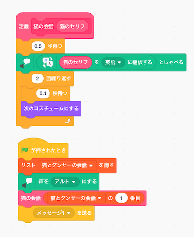

### 1-2. 作り方(How to develop)

- を押してください。

    Press .

- を押してください。

    Press .

- 以下の画面が表示されるので、 **『ブロック名』を『猫の会話』に変更** してください。

    When the following screen is displayed, change the "Block Name" to "Cat Conversation" and press the OK button.

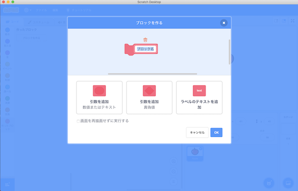

- 『引数を追加(数値またはテキスト)』をクリックし、 **『number or text』を『猫のセリフ』に変更** 後、OKボタンを押してください。

    Click "Add argument (number or text)", change "number or text" to "Cat's line", and then click OK.

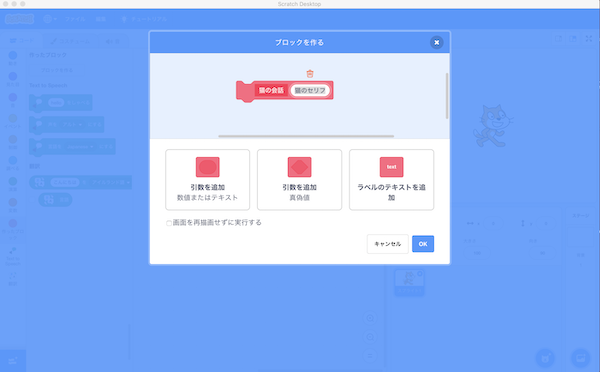

- 以下の画面が表示されることを確認してください。

    Confirm that the following screen is displayed.

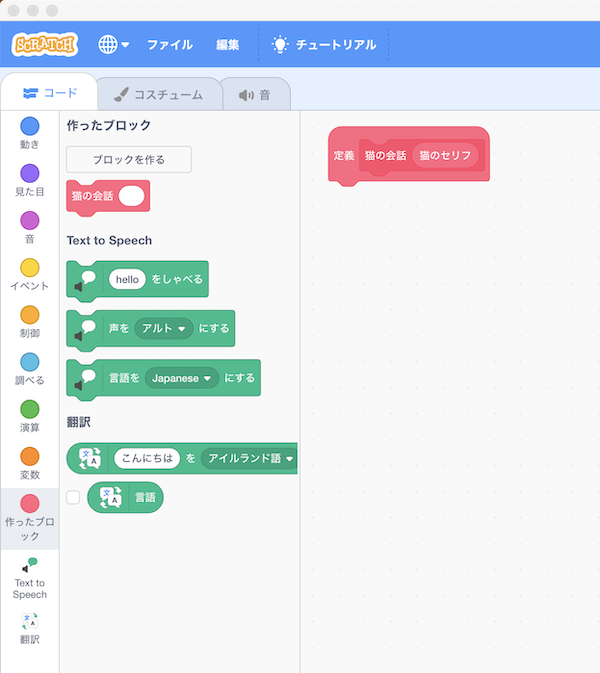

- 以下のブロックを画面中央にドラック＆ドロップします。

    Drag and drop the following blocks to the center of the screen.

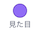 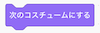

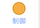 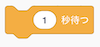×2 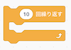

 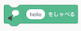

 

- の数字を **0.1と0.5に変更** します。(数字をダブルクリックすることで、数字を編集できる状態になります。)

    Change the number  to 0.1 and 0.5.(Double-clicking on a number, you will be able to edit the number.)

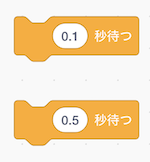

- の数字を **2に変更** します。(数字をダブルクリックすることで、数字を編集できる状態になります。)

    Change the number  to 2. (Double-clicking on a number, you will be able to edit the number.)

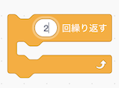

- の **『こんにちわ』** に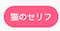をドラッグ＆ドロップしてください。

    Drag and drop the  into "Hello" in .

- の▼ボタンを押し、表示される言語の一覧から **『英語』を選んでください** 。

    Press the ▼ button on A and select "English" from the list of languages displayed.

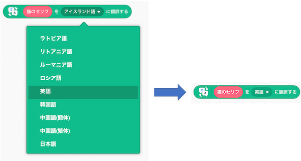

- の『hello』にをドラッグ＆ドロップしてください。

    Drag and drop  to "hello" in .

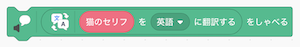

- ブロックをくっつけてください。

    Connect the blocks.

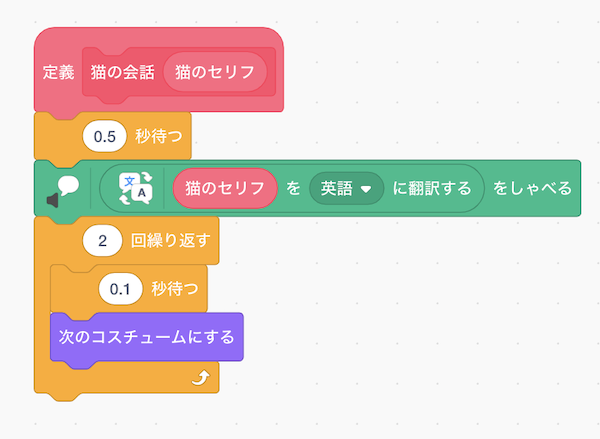

- を押してください。

    Press .

- 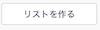を押してください。

    Press .

- **『新しいリスト名：』に『猫とダンサーの会話』と入力** し、OKボタンを押してください。

    Enter "Cat and Dancer's Conversation" in the "New List Name:" field and press the OK button.

- リストが画面上に表示されることを確認してください。

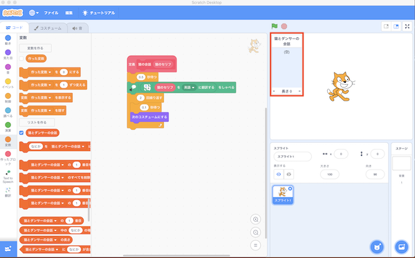

- リストの＋ボタンを押し、 **『踊って』と『いいよ』を設定** してください。

Press the + button on the list and set the "Dancing" and "OK" settings.

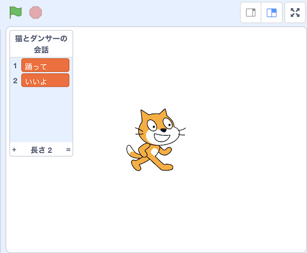

- 以下のブロックを画面中央にドラック＆ドロップします。

    Drag and drop the following blocks to the center of the screen.

  

 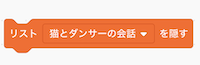 

 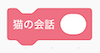

 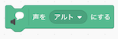

- をにドラッグ＆ドロップしてください。

    Drag and drop  to .

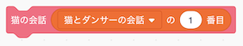

- ブロックをくっつけてください。これでプログラムは完成です。

    Connect the blocks.The program is complete.

Connect the blocks.

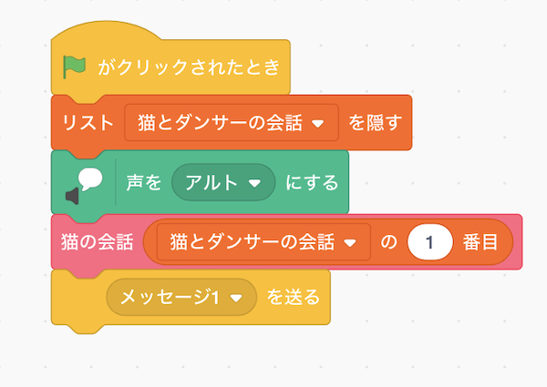

- 最後に、プログラムを保存してください。

    Finally, save the program.

