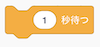
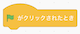

# ダンサーのプログラムの作り方(How to develop a dancer program)

## 1. プログラムを作る前の準備(Preparation before develop the program)

- ボタンをクリックしてください。

    Click on the  button.

- **Champ99** を選択、クリックしてください。

    Select a Champ99 and click on it.

- スプライトが設定されていることを確認してください。

    Confirm that the selected sprite is set.

## 2. プログラムの作り方(How to develop a program)

### 2-1. 完成イメージ(Completed image)

### 2-2. 作り方(How to develop)

- を押してください。

    Press .

- を押してください。

    Press .

- 以下の画面が表示されるので、 **『ブロック名』を『ダンサーの会話』に変更** してください。

    When the following screen is displayed, change the "Block Name" to "Dancer Conversation" and press the OK button.

- 『引数を追加(数値またはテキスト)』をクリックし、 **『number or text』を『ダンサーのセリフ』に変更** 後、OKボタンを押してください。

    Click "Add argument (number or text)", change "number or text" to "Dancer's line", and then click OK.

- 以下の画面が表示されることを確認してください。

    Confirm that the following screen is displayed.

- 以下のブロックを画面中央にドラック＆ドロップします。

    Drag and drop the following blocks to the center of the screen.

 

 

 

- の数字を **0.5に変更** します。(数字をダブルクリックすることで、数字を編集できる状態になります。)

    Change the number  to 0.5.(Double-clicking on a number, you will be able to edit the number.)

- の **『こんにちわ』** にをドラッグ＆ドロップ してください。

    Drag and drop the  into "Hello" in .

- の▼ボタンを押し、表示される言語の一覧から **『英語』** を選んでください。

    Press the ▼ button on A and select "English" from the list of languages displayed.

- の『hello』にをドラッグ＆ドロップしてください。

    Drag and drop  to "hello" in .

- ブロックをくっつけてください。

    Connect the blocks.

- 以下のブロックを画面中央にドラック＆ドロップします。

    Drag and drop the following blocks to the center of the screen.

 

 

- の▼ボタンを押し、表示されるコスチュームの一覧から **『champ99-b』** を選んでください。

    Press ▼ on A and select "champ99-b" from the list of costumes that will display.

- ブロックをくっつけてください。

    Connect the blocks.

- 以下のブロックを画面中央にドラック＆ドロップします。

 

 

  

 

 

 

- をにドラッグ＆ドロップしてください。

    Drag and drop  to .

- の数字を **2に変更** します。(数字をダブルクリックすることで、数字を編集できる状態になります。)

    Change the number  to 2. (Double-clicking on a number, you will be able to edit the number.)

- の▼ボタンを押し、表示される声の一覧から **『テノール』を選んでください** 。

Press the ▼ button in  and select "Tenor" from the list of voices displayed.

- の数字を **0.5に変更** します。(数字をダブルクリックすることで、数字を編集できる状態になります。)

    Change the number  to 0.5.(Double-clicking on a number, you will be able to edit the number.)

- の数字を **7に変更** します。(数字をダブルクリックすることで、数字を編集できる状態になります。)

    Change the number  to 7. (Double-clicking on a number, you will be able to edit the number.)

- ブロックをくっつけてください。

    Connect the blocks.

- 最後に、プログラムを保存してください。

    Finally, save the program.

